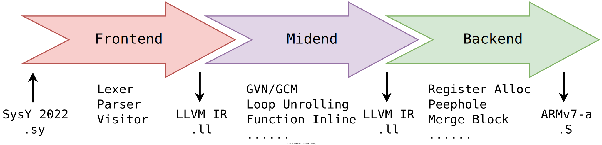

# Meow-Compiler

2022 [全国大学生计算机系统能力大赛编译系统设计赛（华为毕昇杯）](https://compiler.educg.net) 参赛作品。

## Build

Requirements: Java (JDK >= 15)

```bash
mkdir target
javac -d target -encoding 'utf-8' \
  $(find src -type f -name '*.java')
cd target; mkdir -p META-INF; echo -e 'Manifest-Version: 1.0\r\nMain-Class: Compiler\r\n\r\n' > META-INF/MANIFEST.MF
jar cfm compiler.jar META-INF/MANIFEST.MF *
```

Artifact will be stored at <tt>target/compiler.jar</tt> .

## Usage

```
java -jar compiler.jar {(-S|-emit-llvm) -o filename} filename [-On]

Options:
    -S -o filename: generate armv7-a assembly to file.
    -emit-llvm -o filename: generate LLVM IR (.ll) to file.
    filename: source code file.
    -On: optimize level, possible value: -O0, -O1, -O2
```

Examples:

- (Contest Official Functional Test) Generate assembly <tt>test.S</tt> from source <tt>test.sy</tt> without optimization
  ```bash
  java -jar compiler.jar -S test.S test.sy
  ```
- (Contest Official Performance Test) Generate assembly <tt>test.S</tt> from source <tt>test.sy</tt> with optimization
  ```bash
  java -jar compiler.jar -S test.S test.sy -O2
  ```
- Generate LLVM IR <tt>test.ll</tt> from source <tt>test.sy</tt> with optimization
  ```bash
  java -jar compiler.jar -emit-llvm -o test.ll test.sy -O2
  ```
- Generate both LLVM IR and assembly, without optimization and enable assertion
  ```bash
  java -ea -jar compiler.jar -emit-llvm -o test.ll -S -o test.S test.sy
  ```
  
## Run target code

Before running target code, [SysY Runtime Library](https://gitlab.eduxiji.net/nscscc/compiler2022/-/blob/master/SysY2022%E8%BF%90%E8%A1%8C%E6%97%B6%E5%BA%93-V1.pdf) is required first.

- If target code (arm assembly) runs on raspberry pi, you should compile the runtime library on pi first;
- If target code (llvm ir or arm assembly) runs on PC, you can use our [Docker Image](https://github.com/Meow-Twice/sysy-docker) as the environment.

[Testcases](https://gitlab.eduxiji.net/nscscc/compiler2022/-/tree/master/%E5%85%AC%E5%BC%80%E6%A0%B7%E4%BE%8B%E4%B8%8E%E8%BF%90%E8%A1%8C%E6%97%B6%E5%BA%93) can be accessed from educg gitlab.

## Structure



## Optimization and Passes

Mid-end optimization passed is managed at <tt>midend/MidEndRunner.java</tt>, and global control is managed at <tt>util/CenterControl.java</tt> .